```mermaid
flowchart TD
    MSG(["💬 Mensagem do usuário"])
    MSG -->|"'analisar exame de mama'\n'triagem de mama'\n'paciente P002'"| ROUTER{"🔀 classificar_relato\ngrafo_clinico.py"}
    ROUTER -->|"_is_breast_cancer_case_analysis = True"| BC_IN

    subgraph BC_NODE["🎀 etapa_breast_cancer · etapa_breast_cancer.py"]
        BC_IN(["Entrada no nó"])
        BC_IN --> RAG_Q["search_func\nconsulta índice FAISS"]
        BC_IN --> SEL_START["_select_case\nanalisa o relato"]

        subgraph RAG_SUB["📚 Pipeline RAG · busca_medquad.py"]
            FAISS_IDX["Índice FAISS\nMedQuAD ~1.155 docs\nbreast_cancer_screening.md 17 chunks"]
            THRESH{"Similaridade\n≥ 0.55 · k = 3?"}
            DOCS["Chunks recuperados\nmetadata: source_type = curated_protocol\nsource = breast_cancer_screening.md"]
            BULLETS["_extract_bullet_items_from_rag\nmax_items = 8\nbusca itens '- ' e '* '"]
            HAS_B{"Bullets\nencontrados?"}
            SYNTH_B["_build_bullet_based_rag_synthesis\n'O protocolo orienta atenção a X; Y; Z.\nEsses achados devem motivar avaliação.'"]
            SYNTH_S["_build_complete_sentence_synthesis\nsentenças completas do chunk\n_has_incomplete_rag_ending → descarta truncados"]
            SYNTH_GEN["fallback estruturado\ntexto genérico de contingência"]
            RAG_AVAIL(["rag_available = True\nrag_payload: síntese + seção + protocol"])
            RAG_NONE(["rag_available = False\nsem contextualização de protocolo"])

            FAISS_IDX --> THRESH
            THRESH -->|Sim| DOCS
            THRESH -->|Não| RAG_NONE
            DOCS --> BULLETS
            BULLETS --> HAS_B
            HAS_B -->|Sim| SYNTH_B
            HAS_B -->|Não| SYNTH_S
            SYNTH_S -->|truncado / incompleto| SYNTH_GEN
            SYNTH_B --> RAG_AVAIL
            SYNTH_S --> RAG_AVAIL
            SYNTH_GEN --> RAG_AVAIL
        end

        subgraph PAT_SUB["👤 Seleção de Paciente · synthetic_*.csv"]
            HAS_ID{"ID P0XX\nno relato?"}
            ID_CHK{"Existe em\nsynthetic_breast_exam_results.csv?"}
            EXPL["explicit_id\nex.: P002 → P002"]
            NOT_FND(["explicit_id_not_found\nmensagem segura\ntriagem não executada"])
            HAS_NM{"Nome\ncadastrado?"}
            NAME_M["name_match\nCarla Mendes → P005\nAna Silva → P001"]
            HAS_CSV{"CSVs\ndisponíveis?"}
            DEMO["default_demo_case\nP002 + aviso discreto\nna resposta Markdown"]
            HARD["hardcoded_fallback\ndados fixos embutidos\naviso de contingência"]
            PAT_OK(["patient_data · exam_data\n30 features Wisconsin\nnomes com underscore"])

            HAS_ID -->|Sim| ID_CHK
            ID_CHK -->|Sim| EXPL
            ID_CHK -->|Não| NOT_FND
            HAS_ID -->|Não| HAS_NM
            HAS_NM -->|Sim| NAME_M
            HAS_NM -->|Não| HAS_CSV
            HAS_CSV -->|Sim| DEMO
            HAS_CSV -->|Não| HARD
            EXPL --> PAT_OK
            NAME_M --> PAT_OK
            DEMO --> PAT_OK
            HARD --> PAT_OK
        end

        subgraph PRED_SUB["🤖 Predição · breast_cancer_phase2_tool.py"]
            ANALYZE["analyze_breast_cancer_case\npatient_data · exam_data"]
            LOAD["_load_phase2_model\nmodels/breast_cancer_rf_ga_pipeline.joblib"]
            MOD_OK{"Pipeline sklearn\ncarregado?"}
            DF_BUILD["_build_model_dataframe\n30 colunas ordenadas\n_adapt_feature_names:\nconcave_points_mean → 'concave points_mean'"]
            PROBA["pipeline.predict_proba\nColumnTransformer + RandomForestClassifier\nn_estimators=58 · max_depth=10 · balanced"]
            FMT["_format_academic_score\npct = max(prob × 100 · 0.1%)\nevita exibição de 0,00%"]
            INF1(["inference_method = phase2_joblib_model\nROC AUC = 0.997 · Recall = 0.952"])
            RULE["rule_based_fallback\n6 features · limiares didáticos\nRadius · Texture · Perimeter\nArea · Concavity · Concave Points"]
            INF2(["inference_method = rule_based_fallback\naviso na resposta"])
            RISK(["risk_level: alto / moderado / baixo\nprobability · explanation\nrecommendation · limitations"])

            ANALYZE --> LOAD
            LOAD --> MOD_OK
            MOD_OK -->|Sim| DF_BUILD
            DF_BUILD --> PROBA
            PROBA --> FMT
            FMT --> INF1
            INF1 --> RISK
            MOD_OK -->|Não| RULE
            RULE --> INF2
            INF2 --> RISK
        end

        subgraph RESP_SUB["📝 Montagem da Resposta Markdown"]
            RS1["_build_patient_summary_section\nnome · idade · histórico familiar"]
            RS2["_build_integrated_interpretation\n_protocol_clause_for_interpretation\ncita seção RAG por nome · sem repetir bullets"]
            RS3["_build_rag_section\n'Trechos aplicáveis do protocolo recuperado'\nbullets reais do protocolo INCA ou síntese"]
            RS4["_build_transparency_notice\nMétodo da análise: modelo da Fase 2\nou: regra acadêmica de contingência"]
            RS5["response_validator · validate_medical_response\nbloqueio: diagnóstico definitivo\nprescrição · dosagem"]
            RS6["audit_logger\noutputs/audit_logs.jsonl\nflow · risk_level · sources\nsafety_status · summary · fallback_info"]
            RS1 --> RS2 --> RS3 --> RS4 --> RS5 --> RS6
        end

        RAG_Q --> FAISS_IDX
        SEL_START --> HAS_ID
        PAT_OK --> ANALYZE
        RAG_AVAIL --> RS1
        RISK --> RS1
    end

    subgraph ETICA_SUB["🛡️ etapa_etica · seguranca_etica"]
        FILT["Filtro TERMOS_PRESCRICAO\nposologia · mg · ml · gotas · dipirona"]
        AUDIT_DB["salvar_atendimento\nSQLite prontuarios.db\nexibido na sidebar Streamlit"]
        FILT --> AUDIT_DB
    end

    RS6 --> FILT
    AUDIT_DB --> OUT(["✅ Resposta final · Streamlit chat"])

    style BC_NODE   fill:#fce4ec,stroke:#e91e63,color:#333
    style RAG_SUB   fill:#e8f5e9,stroke:#43a047,color:#333
    style PAT_SUB   fill:#e3f2fd,stroke:#1e88e5,color:#333
    style PRED_SUB  fill:#fff3e0,stroke:#fb8c00,color:#333
    style RESP_SUB  fill:#f3e5f5,stroke:#8e24aa,color:#333
    style ETICA_SUB fill:#fff8e1,stroke:#f9a825,color:#333
```

# Diagrama Detalhado — RAG + Predição · Fluxo Breast Cancer

Diagrama interno do nó `etapa_breast_cancer`, detalhando o pipeline de consulta RAG,
seleção de paciente, predição RF+GA e montagem da resposta Markdown.

Para o fluxo geral do LangGraph, ver `docs/diagrama_langgraph.md`.

---

---

## Legenda dos subgrafos

| Cor | Subgrafo | Módulo principal | Responsabilidade |
|---|---|---|---|
| 🟢 Verde | Pipeline RAG | `src/rag/busca_medquad.py` | Consulta FAISS, extração de bullets, síntese de protocolo |
| 🔵 Azul | Seleção de Paciente | `src/engine/etapa_breast_cancer.py` | Resolve ID/nome → dados sintéticos Wisconsin |
| 🟠 Laranja | Predição RF+GA | `src/tools/breast_cancer_phase2_tool.py` | Carrega joblib, constrói DataFrame, `predict_proba` |
| 🟣 Roxo | Montagem da Resposta | `src/engine/etapa_breast_cancer.py` | Markdown estruturado + safety validator + audit JSONL |
| 🟡 Amarelo | Filtro Ético | `src/engine/etapas_clinicas.py` | Filtro de prescrição + gravação SQLite |

---

## Decisões críticas e seus efeitos

### RAG

| Condição | Resultado |
|---|---|
| Score FAISS ≥ 0.55, chunk com bullets | Síntese real do protocolo INCA na seção *Trechos aplicáveis* |
| Score FAISS ≥ 0.55, sem bullets | Sentenças completas extraídas |
| Score FAISS < 0.55 | `rag_available=False`; seção *Trechos* omitida; `_protocol_clause_for_interpretation` usa texto genérico |

### Seleção de paciente

| Método | Quando | Aviso na resposta |
|---|---|---|
| `explicit_id` | ID P0XX reconhecido e existente nos CSVs | Não |
| `name_match` | Nome cadastrado detectado no relato | Não |
| `default_demo_case` | Nenhuma identificação encontrada | Sim — caso demonstrativo P002 |
| `explicit_id_not_found` | ID no relato mas inexistente | Sim — mensagem segura; triagem não executada |
| `hardcoded_fallback` | CSVs indisponíveis | Sim — contingência |

### Predição

| Condição | `inference_method` | Score exibido |
|---|---|---|
| `breast_cancer_rf_ga_pipeline.joblib` carregado + 30 features OK | `phase2_joblib_model` | `predict_proba` real (mín. 0,10%) |
| joblib ausente / scikit-learn não instalado / features faltantes | `rule_based_fallback` | Estimativa por regras didáticas |

---

## Notas de arquitetura

- **RAG e seleção de paciente correm em sequência** dentro do mesmo nó Python — não há paralelismo real; a seleção alimenta a predição, e o RAG alimenta a montagem da resposta.
- **Nenhum LLM é chamado** no fluxo Breast Cancer — toda a resposta é gerada programaticamente por funções `_build_*`.
- **Dois níveis de auditoria** coexistem por design: JSONL detalhado (`outputs/audit_logs.jsonl`) para rastreabilidade acadêmica e SQLite (`prontuarios.db`) para exibição na sidebar Streamlit.
- **`fallback_info`** é retornado no estado LangGraph mas nunca exposto na UI — serve apenas para rastreabilidade interna e testes.
