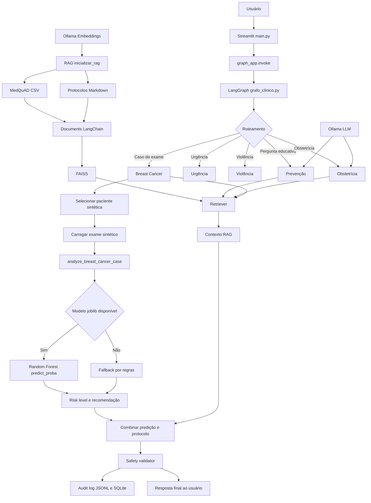

```mermaid
flowchart TD
    A["Usuário"] --> B["Streamlit main.py"]
    B --> C["graph_app.invoke"]
    C --> D["LangGraph grafo_clinico.py"]
    D --> E{"Roteamento"}

    E -->|Caso de exame| F["Breast Cancer"]
    E -->|Pergunta educativa| G["Prevenção"]
    E -->|Urgência| H["Urgência"]
    E -->|Violência| I["Violência"]
    E -->|Obstetrícia| J["Obstetrícia"]

    K["Ollama Embeddings"] --> L["RAG inicializar_rag"]
    L --> M["MedQuAD CSV"]
    L --> N["Protocolos Markdown"]
    M --> O["Documents LangChain"]
    N --> O
    O --> P["FAISS"]
    P --> Q["Retriever"]

    G --> Q
    J --> Q
    F --> Q

    R["Ollama LLM"] --> G
    R --> J

    F --> S["Selecionar paciente sintética"]
    S --> T["Carregar exame sintético"]
    T --> U["analyze_breast_cancer_case"]
    U --> V{"Modelo joblib disponível"}

    V -->|Sim| W["Random Forest predict_proba"]
    V -->|Não| X["Fallback por regras"]

    W --> Y["Risk level e recomendação"]
    X --> Y

    Q --> Z["Contexto RAG"]
    Y --> AA["Combinar predição e protocolo"]
    Z --> AA

    AA --> AB["Safety validator"]
    AB --> AC["Audit log JSONL e SQLite"]
    AB --> AD["Resposta final ao usuário"]
```