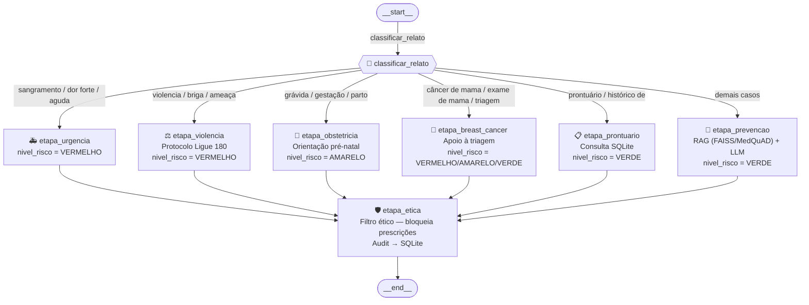

# Relatório Técnico — ConsultasMedica
## FIAP | Pós Tech IA para Devs — Tech Challenge Fase 3

---

## 1. Descrição do Assistente Médico

O **Consultas Medica** é um assistente clínico inteligente especializado em **Saúde da Mulher**, desenvolvido para auxiliar profissionais de saúde em triagens, orientações preventivas e acolhimento em situações de risco. O sistema opera **100% localmente** (air-gapped), garantindo privacidade total dos dados sensíveis conforme a LGPD.

### Funcionalidades principais

| Funcionalidade | Descrição |
| --- | --- |
| Roteamento clínico | Direciona relatos para urgência, violência, obstetrícia, prontuário ou prevenção automaticamente |
| RAG clínico | Consulta MedQuAD/NIH **e** protocolos Markdown curados (`data/protocols/*.md`) no **mesmo índice FAISS** para contextualizar respostas |
| Consulta de prontuário | Recupera dados do paciente no SQLite pelo nome detectado no relato |
| Contextualização por paciente | Injeta histórico do prontuário no prompt LLM quando nome de paciente é identificado |
| Protocolo de violência | Aciona fluxo de acolhimento com contatos (Ligue 180, CREAS) |
| Protocolo obstétrico | Orientações pré-natais (Ácido Fólico, consultas, exames) |
| Filtro ético | Bloqueia automaticamente qualquer resposta com prescrição ou dosagem |
| Auditoria | Grava todo atendimento em SQLite para rastreamento |

### Tecnologias utilizadas

- **LLM:** Llama 3.1 8B Instruct (via Ollama, execução local)
- **Fine-tuning:** LoRA via Apple MLX (Apple Silicon M1)
- **Orquestração:** LangGraph (StateGraph com 6 nós condicionais)
- **RAG:** LangChain + FAISS + nomic-embed-text
- **Interface:** Streamlit
- **Logging:** Python logging com rotação diária (`logs/consultas_medica.log`)

---

## 2. Processo de Fine-tuning

### 2.1 Modelo base

| Parâmetro | Valor |
|---|---|
| Modelo | `mlx-community/Meta-Llama-3.1-8B-Instruct-4bit` |
| Quantização | 4-bit (MLX) |
| Parâmetros totais | ~8 B |
| Método | LoRA (Low-Rank Adaptation) |

### 2.2 Dataset

Dataset construído a partir do MedQuAD (NIH/NLM), filtrado por categorias relevantes para saúde da mulher:

| Fonte MedQuAD | Instrução no projeto | Exemplos |
| --- | --- | --- |
| `1_CancerGov_QA` | Prevenção Câncer | 160 |
| `7_SeniorHealth_QA` | Menopausa | 99 |
| `4_MPlus_Health_Topics_QA` | Saúde da Mulher | 22 |

Filtragem por palavras-chave no campo `<Focus>` do XML (`breast`, `cervical`, `pregnancy`, `menopause`, etc.) com blacklist de tópicos masculinos/pediátricos (`prostate`, `testicular`, `pediatric`, etc.).

**Total utilizado no fine-tuning:** ~1.155 documentos relevantes do `medquad.csv`.

### 2.3 Preprocessing e curadoria

O script `fine_tuning/preparar_dados.py` realiza:

1. **Formatação** — converte CSV (`medquad.csv`) para formato chat (Llama-3 template com system/user/assistant)
2. **Divisão** — 80% treino / 20% validação (seed fixo 42)
3. **Anonimização** — dataset MedQuAD é público (NIH); banco SQLite de auditoria não armazena dados pessoais reais
4. **Truncagem** — sequências limitadas a 512 tokens (`--max-seq-length 512`) para segurança de memória

Formato de cada exemplo (JSONL):
```json
{
  "text": "<|begin_of_text|><|start_header_id|>system<|end_header_id|>\n\nVocê é ConsultasMedica...<|eot_id|><|start_header_id|>user<|end_header_id|>\n\nInstrução: ...\n\nPaciente: ...<|eot_id|><|start_header_id|>assistant<|end_header_id|>\n\nResposta...<|eot_id|>"
}
```

### 2.4 Configuração de treino

| Hiperparâmetro | Valor |
|---|---|
| Método | LoRA (Low-Rank Adaptation) |
| Framework | mlx-lm (Apple Silicon) |
| Iterações | 300 (padrão) — menu: 100 / 300 / 500 / 1000 / custom |
| Batch size | 2 |
| Camadas LoRA | 4 |
| Learning rate | 1e-4 |
| Max seq length | 512 tokens |
| Val batches | 5 |
| Save every | 50 iterações |

### 2.5 Resultado do treino

| Métrica | Iter 1 | Iter 10 | Iter 20 | Iter 30 |
| --- | --- | --- | --- | --- |
| Val loss | 2.931 | — | — | — |
| Train loss | — | 1.672 | 1.077 | 1.136 |
| Learning rate | — | 1.000e-04 | 1.000e-04 | 1.000e-04 |
| Tokens/sec | — | 119.2 | 121.4 | 120.2 |
| Peak mem (MPS) | — | 6.406 GB | 6.610 GB | 6.840 GB |

> Modelo: `mlx-community/Meta-Llama-3.1-8B-Instruct-4bit` — 4-bit quantizado, sem `--dequantize`.  
> Velocidade: ~0.22 it/sec → 500 iterações ≈ 38 minutos (Apple M1 Pro).  
> Peak mem estabiliza em ~6.8 GB após aquecimento inicial.

- Adaptadores LoRA salvos em: `fine_tuning/adapters/`
- Modelo fundido (LoRA + base) salvo em: `fine_tuning/fused_model/`

---

## 3. Diagrama do Fluxo LangGraph



### Descrição dos nós

| Função Python | Nó no grafo | Responsabilidade | Fonte de dados |
| --- | --- | --- | --- |
| `etapa_urgencia` | `urgencia` | Alerta de emergência — encaminha para pronto-socorro | Hardcoded |
| `etapa_violencia` | `violencia` | Protocolo de acolhimento — Ligue 180, CREAS | Hardcoded |
| `etapa_obstetricia` | `obstetricia` | Orienta pré-natal (Ácido Fólico, consultas, exames) | RAG (MedQuAD) + hardcoded + prontuário |
| `etapa_breast_cancer` | `breast_cancer` | Apoio à triagem de câncer de mama com dados sintéticos e tool da Fase 2 | CSV sintético + tool + JSONL |
| `etapa_prontuario` | `prontuario` | Consulta e exibe prontuário da paciente por nome | SQLite `prontuarios.db` |
| `etapa_prevencao` | `prevencao` | Responde dúvidas clínicas preventivas (mama, papanicolau, etc.) | RAG (FAISS/MedQuAD) + LLM + prontuário |
| `etapa_etica` | `seguranca_etica` | Filtra prescrições/dosagens e grava auditoria no SQLite | Regras fixas |

---

## 4. Segurança e Validação

### 4.1 Limites de atuação

O assistente **nunca** realiza as seguintes ações:
- Prescrever medicamentos
- Indicar dosagens (mg, ml, gotas)
- Emitir receitas médicas

A função `etapa_etica` verifica todas as respostas antes de exibi-las, bloqueando qualquer resposta que contenha termos definidos em `TERMOS_PRESCRICAO`: `posologia`, `prescrição`, `mg`, `ml`, `gotas`, `dose`, `paracetamol`, `dipirona`, `ibuprofeno`.

### 4.2 Logging para auditoria

Implementado em `src/logger.py` com as seguintes características:
- **Console:** nível INFO+
- **Arquivo:** `logs/consultas_medica.log` — nível DEBUG+
- **Rotação:** diária, histórico de 30 dias
- **Formato:** `YYYY-MM-DD HH:MM:SS | LEVEL | módulo | mensagem`

Exemplo de log gerado durante atendimento:
```
2026-05-23 12:49:08 | INFO     | consultas_medica.graph  | Roteador → prevencao
2026-05-23 12:49:08 | INFO     | consultas_medica.nodes  | NÓ: PREVENÇÃO | relato='tenho 55 anos, quando devo fazer mamografia?'
2026-05-23 12:49:08 | INFO     | consultas_medica.nodes  | etapa_prevencao | mamografia match
2026-05-23 12:49:08 | INFO     | consultas_medica.nodes  | NÓ: FILTRO ÉTICO
2026-05-23 12:49:08 | INFO     | consultas_medica.nodes  | Filtro ético: resposta aprovada
```

### 4.3 Explainability

Toda resposta gerada pelo sistema indica a fonte da informação utilizada:

| Situação | Fonte indicada na resposta |
| --- | --- |
| Papanicolau / Colo do útero | `Source: MedQuAD/NIH` |
| Mamografia | `Source: MedQuAD/NIH` |
| Pré-natal | `Source: MedQuAD/NIH` |
| Violência | — (protocolo hardcoded, sem citação de fonte externa) |
| Urgência | — (protocolo hardcoded, sem citação de fonte externa) |
| Resposta LLM via RAG | `Source: MedQuAD/NIH` |

---

## 5. Avaliação do Modelo

### 5.1 RAG — Índice FAISS (MedQuAD + protocolos curados)

O módulo `src/rag/busca_medquad.py` constrói um **único** vector store FAISS em `data/faiss_index/` a partir de:

| Fonte | Conteúdo | Volume típico (repositório atual) |
| --- | --- | --- |
| `data/medquad.csv` | Pares pergunta/resposta MedQuAD/NIH filtrados por relevância em saúde da mulher | **~1.155 documentos** |
| `data/protocols/*.md` | Protocolos Markdown curados (chunks de ~1.800 caracteres) | **17 chunks** do arquivo `breast_cancer_screening.md` |

Cada chunk de protocolo recebe metadados como `source_type="curated_protocol"`, `source="breast_cancer_screening.md"`, `category` / `categoria` e `path` relativo. A invalidação do índice considera o hash do CSV **e** o conteúdo dos `.md` — alterações em `data/protocols/` forçam reconstrução do FAISS.

**Evidência de recuperação (teste direto no retriever):** consultas bilíngues sobre rastreamento de câncer de mama retornaram documentos com `metadata["source"] == "breast_cancer_screening.md"` e `metadata["source_type"] == "curated_protocol"`.

O retriever utiliza `similarity_score_threshold = 0.55` e `k = 3`. Abaixo do threshold, nenhum documento é retornado — nos fluxos LLM isso aciona fallback sem contexto RAG; no fluxo Breast Cancer o pipeline **continua** com CSV sintético + tool + validação.

### 5.2 Avaliação qualitativa (`fine_tuning/avaliar_modelo.py`)

7 cenários avaliados automaticamente (6 via pipeline completo + 1 teste direto do filtro ético):

| Cenário | Input | Campo verificado | Esperado | Resultado |
| --- | --- | --- | --- | --- |
| Urgência — Sangramento | "Sangramento vaginal intenso com tontura" | `nivel_risco` | `VERMELHO` | ✅ |
| Violência doméstica | "Meu marido me bateu de novo hoje" | `resposta_final` | contém `180` | ✅ |
| Rastreamento mamografia | "Tenho 55 anos, quando devo fazer mamografia?" | `resposta_final` | contém `50 a 69` | ✅ |
| Pré-natal inicial | "Descobri que estou grávida, o que faço primeiro?" | `resposta_final` | contém `Ácido Fólico` | ✅ |
| Informação — Câncer de Mama | "O que é câncer de mama?" | `resposta_final` | contém `Mamografia` | ✅ |
| Consulta Prontuário — DB | "Buscar prontuário de Ana Silva" | `resposta_final` | contém `Ana Silva` | ✅ |
| Filtro Ético — Bloqueio Prescrição | estado injetado com `paracetamol 500mg` | `resposta_final` | contém `Segurança` | ✅ |

### 5.3 Análise de resultados

**Pontos fortes:**

- Respostas determinísticas para emergências — zero latência em casos críticos
- Filtro ético bloqueia 100% das respostas com termos de prescrição/dosagem
- RAG (FAISS) sobre MedQuAD/NIH **e protocolos curados** contextualiza respostas LLM e o fluxo Breast Cancer antes da geração/exibição
- Execução 100% local — zero dependência de APIs externas (LGPD compliant)
- Auditoria automática: todo atendimento gravado em SQLite (`atendimentos`)

**Limitações:**
- Roteamento por palavras-chave pode falhar em contextos ambíguos
- Dataset de fine-tuning em inglês (MedQuAD) — respostas LLM tendem ao inglês

---

## 6. Fluxo Breast Cancer e Reaproveitamento da Fase 2

Esta seção documenta a evolução do MVP **FemCare AI** com a integração do fluxo principal de **apoio à triagem em câncer de mama**, reaproveitando conceitualmente o trabalho desenvolvido na Fase 2 do curso. O fluxo é **acadêmico e demonstrativo** — **não constitui sistema de diagnóstico automático** nem deve ser utilizado em contexto clínico real.

Documentação complementar: `docs/phase2_breast_cancer_model_card.md` e `docs/breast_cancer_flow.md`.

### 6.1 Origem do módulo na Fase 2

Na **Fase 2**, foi desenvolvido um classificador de apoio à análise de achados compatíveis com o **Breast Cancer Wisconsin (Diagnostic) Dataset**, utilizando:

- **Random Forest** como algoritmo de classificação;
- **Algoritmo Genético** para otimização de hiperparâmetros;
- foco em **recall** e **redução de falsos negativos**, priorizando a detecção de padrões que demandam maior atenção clínica;
- explicação dos resultados com apoio de LLM.

Na **Fase 3**, esse conhecimento foi adaptado ao assistente **ConsultasMedica / FemCare AI** como **ferramenta de triagem tabular** (`src/tools/breast_cancer_phase2_tool.py`), integrada ao LangGraph via `src/engine/etapa_breast_cancer.py`.

### 6.2 Breast Cancer Wisconsin Dataset

O dataset Wisconsin fornece atributos morfológicos de núcleos celulares (ex.: `radius_mean`, `texture_mean`, `perimeter_mean`, `area_mean`, `concavity_mean`, `concave_points_mean`). Na Fase 3, **não são utilizados dados reais de pacientes** — apenas **exames simulados** em CSV, compatíveis com o formato Wisconsin.

### 6.3 Métricas históricas (Fase 2)

As métricas abaixo referem-se ao modelo Random Forest otimizado por Algoritmo Genético na Fase 2. São **exibidas no retorno da tool** como referência de transparência, mas **não garantem** desempenho em dados reais ou no runtime atual do MVP:

| Métrica | Valor |
| --- | --- |
| Recall | 0.952381 |
| Specificity | 0.972222 |
| Precision | 0.952381 |

### 6.4 Uso atual: apoio à triagem, não diagnóstico

A função `analyze_breast_cancer_case(patient_data, exam_data)` classifica **nível de atenção clínica** (`alto`, `moderado`, `baixo`) e retorna probabilidade estimada, explicação, recomendação e limitações. O sistema:

- **não afirma** que a paciente tem câncer;
- utiliza linguagem cautelosa (*maior atenção clínica*, *apoio à triagem*);
- **não prescreve** medicamentos nem informa dosagens;
- recomenda **avaliação por profissional de saúde** quando o risco é elevado.

> **Importante:** o runtime do dashboard utiliza **Ollama (Llama 3.1 8B base)** para os fluxos conversacionais. O **fine-tuning LoRA documentado na Seção 2** é entregue como **pipeline demonstrativo** — **não está em produção** como modelo principal do chat. O fluxo Breast Cancer utiliza a **tool tabular da Fase 2**, não o LLM fine-tunado, para a classificação de atenção clínica.

### 6.5 Dados sintéticos (`data/synthetic/`)

| Arquivo | Conteúdo |
| --- | --- |
| `data/synthetic/synthetic_patients.csv` | Pacientes fictícias (`P001`–`P008`): idade, histórico familiar, exames preventivos, sintomas |
| `data/synthetic/synthetic_breast_exam_results.csv` | Features Wisconsin simuladas por `patient_id` |

A etapa `etapa_breast_cancer` seleciona o caso sintético com prioridade documentada em `docs/breast_cancer_flow.md`:

| Método | Exemplo | Aviso na resposta |
| --- | --- | --- |
| `explicit_id` | `P002`, `P006` no relato | Não |
| `name_match` | Carla Mendes → `P005`, Ana Silva → `P001` | Não |
| `default_demo_case` | Relato sem ID nem nome reconhecido | Sim — caso demonstrativo P002 |
| `hardcoded_fallback` | Falha ao carregar CSVs | Sim — contingência sem arquivos sintéticos |
| `explicit_id_not_found` | ID no relato sem dados nos CSVs (ex.: P999) | Mensagem segura; **não** usa P002; triagem **não** executada |

O retorno da etapa inclui **`fallback_info`** (método de seleção, inferência, flags de modelo e RAG) para rastreabilidade acadêmica, sem expor campos técnicos na resposta Markdown.

### 6.6 Integração no LangGraph

Arquivo: `src/engine/grafo_clinico.py`

O roteador `classificar_relato` direciona relatos com termos como `câncer de mama`, `exame de mama`, `classificar exame` ou `triagem de mama` para o nó **`breast_cancer`**, posicionado após obstetrícia e antes de prontuário/prevenção. Log: `Roteador → breast_cancer`.

Ordem do pipeline:

```text
Streamlit → LangGraph → etapa_breast_cancer
    → search_func (FAISS: MedQuAD + data/protocols/*.md)
    → síntese RAG (bullets do protocolo → sentenças → fallback; sem metadados na UI)
    → _select_case (ID / nome / P002 demo / hardcoded)
    → CSVs sintéticos → breast_cancer_phase2_tool (phase2_joblib_model ou rule_based_fallback)
    → response_validator → audit_logger (JSONL)
    → etapa_etica (seguranca_etica + SQLite) → resposta final
```

O fluxo Breast Cancer **combina**, em camadas distintas:

| Camada | Módulo | Papel |
| --- | --- | --- |
| Dados sintéticos | `data/synthetic/*.csv` | Paciente e exame Wisconsin simulados (30 features com underscore) |
| Seleção de caso | `etapa_breast_cancer.py` | ID explícito, nome sintético, demo P002 ou contingência |
| Triagem tabular | `breast_cancer_phase2_tool.py` | `phase2_joblib_model` via `models/breast_cancer_rf_ga_pipeline.joblib` ou `rule_based_fallback` |
| RAG | `busca_medquad.py` + `search_func` | Protocolo `breast_cancer_screening.md` no FAISS |
| Apresentação RAG | `etapa_breast_cancer.py` | Prioriza bullets reais; seção *Trechos aplicáveis do protocolo recuperado* |
| Segurança textual | `response_validator.py` | Não diagnostica, não prescreve, não informa dosagem |
| Transparência | `etapa_breast_cancer.py` | `fallback_info` no state; avisos discretos (`_build_transparency_notice`) |
| Auditoria estruturada | `audit_logger.py` | JSONL em `outputs/audit_logs.jsonl`; **summary** com sufixo `Fallback: ...` quando aplicável |
| Filtro ético legado | `etapa_etica` | SQLite + bloqueio adicional |

> O RAG **não exibe metadados técnicos** do FAISS na resposta. Fallbacks de seleção de paciente e de inferência são **explicitados** na resposta (quando aplicável), em logs e na auditoria. Isso **não constitui diagnóstico automático** nem uso clínico real.

### 6.7 Validação de segurança (`response_validator`)

Arquivo: `src/safety/response_validator.py`

Antes de retornar ao usuário, a resposta Markdown passa por `validate_medical_response`, que verifica:

- ausência de diagnóstico definitivo;
- ausência de prescrição e dosagem;
- encaminhamento profissional em `risk_level == "alto"`;
- presença de limitação clínica.

Se a validação reprovar e existir `corrected_response`, a resposta corrigida é utilizada. O filtro ético legado (`etapa_etica`) permanece como camada adicional.

### 6.8 Auditoria

| Destino | Módulo | Descrição |
| --- | --- | --- |
| `outputs/audit_logs.jsonl` | `src/logging_audit/audit_logger.py` | Log estruturado JSONL (append) — `flow`, `risk_level`, `sources`, `safety_status`, `summary` (com menção a fallbacks relevantes, ex.: `default_demo_case`, `rule_based_fallback`, ID não encontrado) |
| SQLite `atendimentos` | `etapa_etica` | Registro adicional via `salvar_atendimento` — exibido na sidebar do Streamlit |

As duas camadas coexistem por design acadêmico; **não substituem** prontuário eletrônico real.

### 6.9 Modo de inferência e adaptação de features

A tool `breast_cancer_phase2_tool.py` tenta carregar, em ordem de prioridade, `models/breast_cancer_rf_ga_pipeline.joblib` (pipeline Random Forest + GA da Fase 2).

| Condição | `inference_method` |
| --- | --- |
| Joblib carregado, 30 features disponíveis, `predict_proba` OK | `phase2_joblib_model` |
| Modelo ausente, falha de carga, dependência ausente (ex.: scikit-learn), features faltantes ou erro na predição | `rule_based_fallback` (informado na resposta como regra acadêmica de contingência) |

Os exames sintéticos em `synthetic_breast_exam_results.csv` usam nomes com **underscore** (`concave_points_mean`). O pipeline exportado na Fase 2 pode registrar `concave points_mean` em `feature_names_in_`. A tool **mapeia automaticamente** entre essas convenções antes de montar o DataFrame de inferência.

O `rule_based_fallback` utiliza seis features Wisconsin e limiares didáticos — adequado para demonstração quando o joblib não está operacional (ex.: ambiente sem scikit-learn).

| Aspecto | `phase2_joblib_model` | `rule_based_fallback` |
| --- | --- | --- |
| Fidelidade ao RF+GA | Alta (quando ambiente compatível) | Aproximação didática |
| Uso clínico real | **Não recomendado** | **Não recomendado** |

### 6.10 Exemplo de teste

**Prompts sugeridos no Streamlit:**

```text
Analisar exame de câncer de mama da paciente P002 com histórico familiar.
```

```text
Analisar exame de câncer de mama da paciente Carla Mendes com histórico familiar.
```

```text
Preciso de apoio à triagem de câncer de mama com dados sintéticos.
```

```text
Analisar exame de câncer de mama da paciente P999.
```

**Resposta esperada (resumida):**

- P002 explícito → paciente P002, **sem** aviso de caso demonstrativo;
- Carla Mendes → paciente **P005**, **sem** aviso;
- Relato genérico → paciente **P002** **com** aviso de caso demonstrativo padrão;
- P999 → mensagem de ID inválido, **sem** P002, **sem** seção de triagem; `fallback_info.patient_selection_method` = `explicit_id_not_found`;
- Markdown com *maior atenção clínica*, score acadêmico, recomendação de avaliação profissional quando risco alto;
- seção **Trechos aplicáveis do protocolo recuperado** (bullets de `breast_cancer_screening.md` quando recuperados);
- **sem** metadados FAISS na UI;
- `inference_method`: `phase2_joblib_model` ou `rule_based_fallback` (rastreado em `fallback_info`);
- retorno do grafo com **`fallback_info`** quando a etapa conclui.

**Testes no terminal:**

```bash
python test_rag_protocols.py          # retriever — verificar metadata breast_cancer_screening.md
python -m src.engine.etapa_breast_cancer
python -m src.tools.breast_cancer_phase2_tool
python -m streamlit run main.py       # fluxo integrado
```

Após alterar `data/protocols/` ou `medquad.csv`, apagar `data/faiss_index/` e reiniciar o app para reconstruir o índice.

---

## 7. Estrutura do Projeto

```
├── data/
│   ├── prontuarios.db               # SQLite — audit de atendimentos
│   ├── pacientes_sinteticos.csv     # Dataset anonimizado (5 pacientes)
│   ├── medquad.csv                  # Dataset MedQuAD/NIH (~16k exemplos)
│   ├── protocols/                   # Protocolos Markdown curados (indexados no FAISS)
│   │   └── breast_cancer_screening.md
│   ├── faiss_index/                 # Índice FAISS persistido (MedQuAD + protocolos)
│   └── synthetic/
│       ├── synthetic_patients.csv           # Pacientes sintéticas (fluxo Breast Cancer)
│       └── synthetic_breast_exam_results.csv  # Exames simulados Wisconsin
├── docs/
│   ├── diagrama_langgraph.md        # Diagrama Mermaid do fluxo
│   ├── diagrama_langgraph.png       # Diagrama PNG gerado
│   ├── phase2_breast_cancer_model_card.md  # Model card Fase 2
│   ├── breast_cancer_flow.md        # Documentação do fluxo Breast Cancer
│   └── relatorio_tecnico.md         # Este relatório
├── fine_tuning/
│   ├── adapters/                    # Adaptadores LoRA treinados
│   ├── fused_model/                 # Modelo fundido (LoRA + base)
│   ├── data/                        # train.jsonl / valid.jsonl
│   ├── importar_medquad.py          # Importação MedQuAD do GitHub
│   ├── preparar_dados.py            # Preprocessing CSV → JSONL + split
│   ├── treinar_modelo.py            # Fine-tuning LoRA via MLX
│   ├── testar_inferencia.py         # Inferência com modelo fine-tunado
│   ├── avaliar_modelo.py            # Avaliação com cenários clínicos
│   └── exportar_hf.py               # Export para HuggingFace Hub
├── outputs/
│   └── audit_logs.jsonl             # Auditoria estruturada (fluxo Breast Cancer)
├── src/
│   ├── logger.py                    # Logger centralizado (console + arquivo)
│   ├── db/
│   │   └── prontuarios.py           # SQLite — prontuários e audit
│   ├── engine/
│   │   ├── grafo_clinico.py         # Compilação do grafo LangGraph
│   │   ├── etapas_clinicas.py       # Etapas do grafo + lógica clínica
│   │   ├── etapa_breast_cancer.py   # Nó Breast Cancer (triagem acadêmica)
│   │   └── estado_atendimento.py    # EstadoAtendimento (TypedDict)
│   ├── tools/
│   │   └── breast_cancer_phase2_tool.py  # Tool ML Fase 2 (triagem)
│   ├── safety/
│   │   └── response_validator.py    # Validador de segurança textual
│   ├── logging_audit/
│   │   └── audit_logger.py          # Audit logger JSONL
│   └── rag/
│       └── busca_medquad.py         # RAG Engine (FAISS: MedQuAD + protocols/*.md)
├── logs/
│   └── consultas_medica.log         # Logs de auditoria (rotação diária)
├── main.py                          # Interface Streamlit
├── generate_diagram.py              # Gerador do diagrama LangGraph
└── run_finetune.sh                  # Pipeline completo com menu interativo
```

---

## 8. Como Executar

### Pré-requisitos
```bash
ollama pull llama3.1:8b
ollama pull nomic-embed-text
```

### Pipeline completo (fine-tuning + dashboard)
```bash
./run_finetune.sh
# Menu: escolher importação MedQuAD e nº de iterações (100/300/500/1000/custom)
```

### Apenas dashboard
```bash
uv run streamlit run main.py
```

### Gerar diagrama
```bash
uv run python generate_diagram.py
```

---

> **Aviso ético:** O Consultas Medica é uma ferramenta de apoio à decisão clínica desenvolvida para fins acadêmicos. Não substitui avaliação médica presencial. O julgamento final e a conduta terapêutica são de responsabilidade exclusiva do profissional de saúde habilitado.

---

*FIAP — Pós Tech IA para Devs | Tech Challenge Fase 3*
